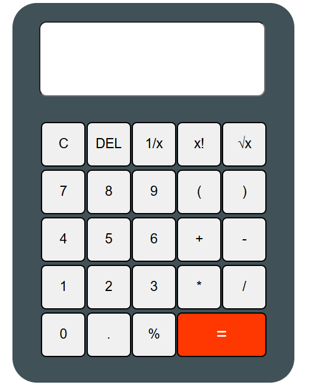

# Basic-calculator-
The project title is Basic Calculator with HTML ,CSS and JavaScript. This calculator can perform arithmetic operations.It also has <strong>C</strong> button which can clear screen, <strong>Del</strong> button for deleting the values on the screen and <strong>=</strong> button for evaluating expressions. you can also calculate factorial of a number by clicking <strong>x!</strong> button after entering the value. <strong>1/x</strong> button takes the value and performs division of the value with 1 as numerator.you can also perform square root of the given value by clicking on the <strong>&#8730;x</strong> button.This Calculator can respond to both button clicks and keyboard inputs.It also follows BODMAS rule. 

